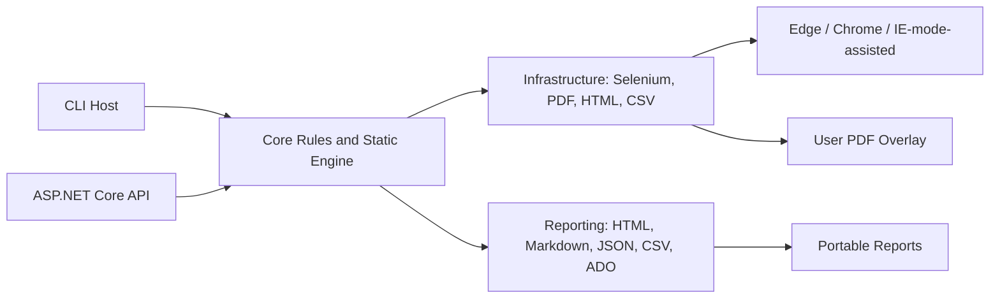

# legacy-accessibility-static-crawler

Production-oriented .NET 8 / C# static accessibility assessment crawler for modern and legacy websites, including assisted workflows for systems that may require Microsoft Edge IE mode.

The core system works without LLMs, OpenAI, Azure OpenAI, Foundry, or any cloud AI service. Optional future LLM support is represented only by a disabled `ILlmReviewService` interface.

For step-by-step instructions written for non-technical users, including authenticated crawls and Azure DevOps CSV export, see [docs/non-technical-user-guide.md](docs/non-technical-user-guide.md). For the browser-based UI, see [docs/ui-mode.md](docs/ui-mode.md). For required downloads, browser drivers, and portable release packaging, see [docs/dependencies-and-packaging.md](docs/dependencies-and-packaging.md).

## What It Does

- Crawls authorized websites with Selenium.
- Supports `modern-edge`, `chrome`, and `edge-ie-mode-assisted`.
- Captures HTML, screenshots, DOM-derived evidence, headings, links, buttons, forms, labels, images, tables, iframes, ARIA attributes, focusable elements, and legacy risks.
- Runs deterministic static checks against built-in rule packs.
- Optionally extracts guidance overlays from a supplied PDF.
- Generates JSON, HTML, Markdown, CSV, executive summary, and Azure DevOps backlog CSV reports.
- Imports manual findings for IE-mode and assistive technology validation.

## What It Does Not Do

This tool does not:

- Certify ADA compliance.
- Certify WCAG compliance.
- Certify Section 508 compliance.
- Replace manual accessibility review.
- Guarantee compliance.
- Require AI.
- Upload sensitive page content to cloud services.
- Store usernames or passwords.
- Bypass authentication or authorization controls.

Automated testing does not replace manual accessibility testing. Screen reader, keyboard, user-flow, and assistive technology testing are still required.

## Official References

- [ADA Title II web and mobile app accessibility rule](https://www.ada.gov/resources/2024-03-08-web-rule/)
- [WCAG 2.1](https://www.w3.org/TR/WCAG21/)
- [WCAG 2.2](https://www.w3.org/TR/WCAG22/)
- [Section 508 testing resources](https://www.section508.gov/test/)
- [ICT Testing Baseline](https://ictbaseline.access-board.gov/)

## Architecture



## Version Pins

Project version: `1.0.0` in `Directory.Build.props` and `VERSION.txt`.

Runtime and major package pins:

| Component | Version |
| --- | --- |
| .NET target framework | `net8.0` |
| Selenium.WebDriver | `4.27.0` |
| Selenium.WebDriver.ChromeDriver | `131.0.6778.20400` |
| Selenium.WebDriver.MSEdgeDriver | `147.0.3912.98` |
| UglyToad.PdfPig | `1.7.0-custom-5` |
| HtmlAgilityPack | `1.11.71` |
| AngleSharp | `1.1.2` |
| CsvHelper | `33.0.1` |
| Scriban | `7.2.0` |
| Swashbuckle.AspNetCore | `6.9.0` |
| xUnit | `2.9.3` |

Repository keywords: `accessibility`, `wcag`, `ada-title-ii`, `section-508`, `selenium`, `dotnet-8`, `csharp`, `ie-mode`, `static-analysis`, `azure-devops`.

## Rule Sources

Built-in rule packs live in `src/LegacyAccessibilityCrawler.Core/RulePacks/`:

- `wcag-2.1-aa-static-rules.json`
- `section-508-static-rules.json`
- `wcag-2.2-static-rules.json`
- `rule-mapping.json`

PDF-derived rules are guidance overlays. They enrich severity, mapping, descriptions, and remediation text, but do not replace built-in deterministic checks.

## CLI Examples

Extract PDF guidance:

```bash
dotnet run --project src/LegacyAccessibilityCrawler.Cli -- extract-rules \
  --rules-pdf ./samples/sample-rules.pdf \
  --output ./reports/rules
```

Modern Edge crawl:

```bash
dotnet run --project src/LegacyAccessibilityCrawler.Cli -- crawl \
  --url https://example.gov \
  --browser modern-edge \
  --max-pages 25 \
  --depth 2 \
  --standard wcag21aa \
  --output ./reports/example
```

Chrome crawl:

```bash
dotnet run --project src/LegacyAccessibilityCrawler.Cli -- crawl \
  --url https://example.gov \
  --browser chrome \
  --max-pages 25 \
  --depth 2 \
  --output ./reports/example-chrome
```

Edge IE-mode-assisted crawl:

```bash
dotnet run --project src/LegacyAccessibilityCrawler.Cli -- crawl \
  --url https://legacy.example.gov \
  --browser edge-ie-mode-assisted \
  --manual-session true \
  --max-pages 10 \
  --depth 1 \
  --rules-pdf ./samples/sample-rules.pdf \
  --output ./reports/legacy-ie
```

Generate reports from existing scan results:

```bash
dotnet run --project src/LegacyAccessibilityCrawler.Cli -- report \
  --scan-results ./reports/example/scan-results.json \
  --output ./reports/example/final
```

Version:

```bash
dotnet run --project src/LegacyAccessibilityCrawler.Cli -- version
```

## API

Run the Swagger-enabled API:

```bash
dotnet run --project src/LegacyAccessibilityCrawler.Api
```

Endpoints:

- `POST /api/crawl/start`
- `POST /api/rules/extract`
- `POST /api/findings/import`
- `POST /api/report/generate`
- `GET /api/jobs/{id}`
- `GET /api/reports/{id}`
- `GET /api/rulepacks`
- `GET /api/rulepacks/{id}`
- `GET /api/version`

## Browser UI

Run the API and open:

```text
http://localhost:5000/ui/
```

The UI provides a crawl form with dropdowns and text boxes for common options, including browser mode, rule pack, max pages, crawl depth, optional PDF rules path, manual login mode, and headless execution. A dashboard lists generated reports and links directly to the HTML report, findings CSV, JSON report, executive summary, and Azure DevOps `ado-items.csv`.

## IE Mode

IE-mode systems differ because legacy controls, ActiveX, old document modes, frames, and browser compatibility layers may not expose complete automation evidence. In `edge-ie-mode-assisted`, the tool supports manual login/session continuation and automatically adds a legacy manual review finding when DOM capture is limited or legacy risks are detected.

## Manual Findings

Manual findings can be imported from CSV using the sample shape in `samples/sample-manual-findings.csv`. Use this for screen reader results, keyboard findings, IE-mode validation, and workflow issues that static scanning cannot prove.

## Downloadable Executable / Portable Release

Initial distribution is ZIP-based. An MSI installer is possible later, but portable ZIPs are simpler to approve and run on test workstations.

1. Download the ZIP for your platform from GitHub Releases.
2. Extract the folder on an approved test workstation.
3. Review `appsettings.example.json`.
4. Run the executable.

Users do not need the .NET SDK when using a self-contained release ZIP. They still need Chrome or Edge installed. WebDriver binaries are included through Selenium driver packages where supported, but browser versions and driver versions must remain compatible.

Windows example:

```powershell
legacy-a11y-crawler.exe --help
legacy-a11y-crawler.exe crawl ^
  --url https://example.gov ^
  --browser modern-edge ^
  --max-pages 25 ^
  --depth 2 ^
  --standard wcag21aa ^
  --output reports/example
```

## Publishing

CLI self-contained publish examples:

```powershell
./scripts/publish-win-x64.ps1 -Version 1.0.0
```

```bash
./scripts/publish-linux-x64.sh 1.0.0
./scripts/publish-osx-arm64.sh 1.0.0
```

Release ZIPs include executable, `appsettings.example.json`, README, docs, samples, LICENSE, VERSION.txt, and CHANGELOG.md.

Release ZIPs do not include reports, screenshots, raw HTML captures, `.env`, credentials, cookies, or browser profile data.

For a detailed dependency and packaging matrix, see [docs/dependencies-and-packaging.md](docs/dependencies-and-packaging.md).

## Sensitive Data

Reports, screenshots, and raw HTML may contain sensitive information. Use same-domain crawling, query-string redaction, approved output locations, and manual login without credential storage. Do not commit generated reports or captures.

## Testing

```bash
dotnet test legacy-accessibility-static-crawler.sln
```

Test coverage includes rule loading, WCAG/Section 508 mapping, static checks, report generation, ADO export, IE-mode disclaimer behavior, no-AI mode, and manual findings import.
